# Zero-Shot AEC Object Detection

Zero-shot object detection for construction site audio equipment using **OWL-ViTv2** (`google/owlv2-base-patch16-ensemble`). No training data required — detects objects from plain-English text descriptions.

**GitHub:** [JChiaHH/Object\_Detection\_Adaptation](https://github.com/JChiaHH/Object_Detection_Adaptation/tree/main)

## Detected Classes

| Class | Description |
|---|---|
| `portable_sound_meter` | Handheld digital sound level meter held by a person |
| `fixed_noise_monitor` | Weatherproof enclosure on tripod or pole |
| `portable_sound_barrier` | Freestanding modular panels or inflatable enclosures around machinery |
| `fixed_sound_barrier` | Large permanent hoarding wall at construction site perimeter |
| `measuring_tape` | Retractable tape measure cassette with extended blade |

---

## Setup

```bash
conda create -n aec-detection python=3.11 -y
conda activate aec-detection
pip install torch torchvision transformers Pillow numpy
```

---

## Project Structure

```
├── frames/                     # Input images (JPEG/PNG)
├── output/
│   ├── detections.json         # Raw detection results
│   ├── evaluation.json         # mAP evaluation results
│   └── visualizations/         # Annotated output images
├── annotations/                # LabelMe JSON annotations (ground truth)
├── ground_truth.json           # Compiled ground truth bounding boxes
├── inference.py                # Main detection script
├── evaluate.py                 # mAP evaluation script
├── detections_to_labelme.py    # Convert detections → LabelMe pre-annotations
└── convert_annotations.py      # Convert LabelMe/XML annotations → ground_truth.json
```

---

## Usage

### 1. Run Inference

Place your images in `./frames/` then run:

```bash
python inference.py --frames_dir ./frames --output_dir ./output
```

Outputs:
- `output/detections.json` — bounding boxes with confidence scores
- `output/visualizations/det_*.jpg` — visualised detections overlaid on frames

### 2. Evaluate (mAP)

Requires `ground_truth.json` (see Annotation section below).

```bash
python evaluate.py \
    --detections ./output/detections.json \
    --ground_truth ./ground_truth.json \
    --output ./output/evaluation.json
```

### 3. Annotate Ground Truth (optional)

**Step 1** — Convert detections to LabelMe pre-annotations:
```bash
python detections_to_labelme.py \
    --detections ./output/detections.json \
    --frames_dir ./frames \
    --output_dir ./annotations
```

**Step 2** — Open LabelMe to review/correct:
```bash
python -m labelme
```

**Step 3** — Compile annotations to `ground_truth.json`:
```bash
python convert_annotations.py \
    --ann_dir ./annotations \
    --format labelme \
    --output ./ground_truth.json
```

---

## Results

Evaluated on 20 manually annotated egocentric construction site frames using the COCO mAP protocol.

| Class | N GT | AP@0.5 | AP@0.5:0.95 |
|---|---|---|---|
| Portable sound meter | 3 | 0.6634 | 0.6634 |
| Fixed noise monitor | 4 | 0.5644 | 0.5644 |
| Portable sound barrier | 5 | 0.5474 | 0.5474 |
| Fixed sound barrier | 4 | **1.0000** | **1.0000** |
| Measuring tape | 8 | 0.8713 | 0.7753 |
| **mAP (mean)** | | **0.7293** | **0.7101** |

### Key design decisions

- **Prompt ensembling** — 3 text variants per class (15 prompts total) in a single forward pass; max score per class per patch is retained. Covers intra-class visual diversity (e.g., blue inflatable vs. grey quilted barriers).
- **Per-class confidence thresholds** — tuned from TP/FP confidence distributions rather than a single global threshold.
- **Cross-class NMS** — suppresses the lower-confidence box when two different classes overlap the same region.
- **Proximity-based box merging** — merges same-class boxes whose gap is < 50% of the shorter box side (handles split tape measure detections).

---

## Detection Visualisations

Predicted bounding boxes overlaid on the 20 evaluation frames, grouped by class. Box colour matches class; confidence score is shown in the label.

---

### Fixed noise monitor — AP@0.5: 0.5644 (N=4)

<table>
<tr>
<td>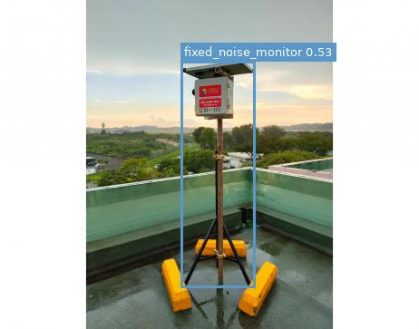</td>
<td>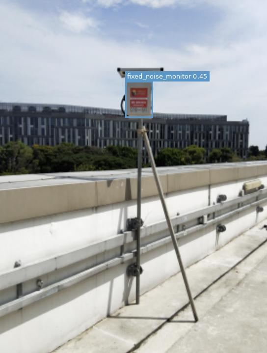</td>
<td>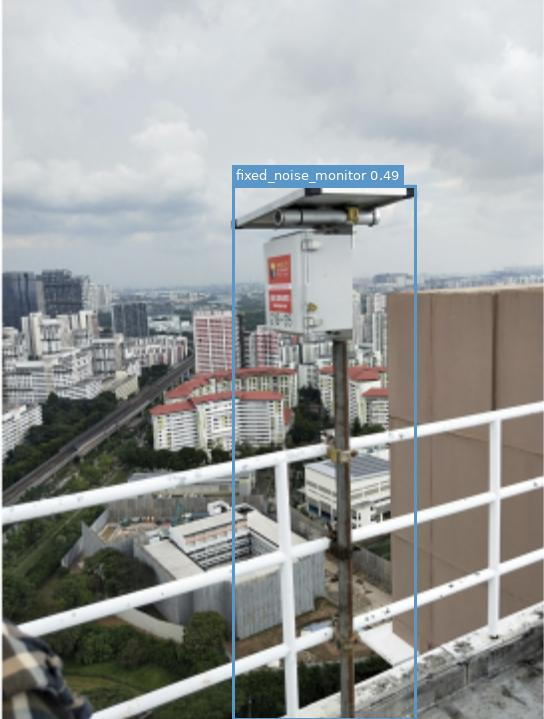</td>
</tr>
</table>

The model correctly identifies tripod- and pole-mounted NEA-style noise monitoring stations at confidence 0.45–0.53 across three of the four ground-truth instances. The fourth instance (`soundmeter2`) was a **missed detection**: the monitor was partially obscured by dense foliage, pushing the similarity score below threshold. Box boundaries typically include the full instrument mast rather than tightly fitting the instrument head alone — a minor localisation imprecision that slightly depresses AP@0.5:0.95 relative to AP@0.5.

---

### Portable sound meter — AP@0.5: 0.6634 (N=3)

<table>
<tr>
<td>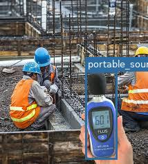</td>
<td>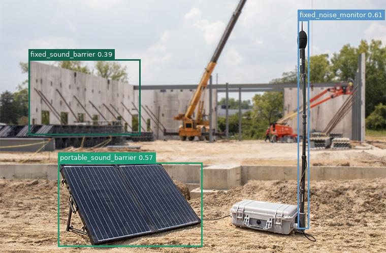</td>
</tr>
</table>

Handheld meters held by workers are correctly detected in cluttered construction-site scenes. The right image is a noteworthy **multi-class frame**: a single image yields three simultaneous detections — `fixed_noise_monitor` (0.61), `portable_sound_barrier` (0.57), and `fixed_sound_barrier` (0.39) — demonstrating that the pipeline can handle multiple target classes co-occurring in one frame. The lower AP for this class (vs. fixed barriers) reflects overlapping TP/FP confidence distributions, requiring a higher threshold of 0.40 that trades some recall for precision.

---

### Portable sound barrier — AP@0.5: 0.5474 (N=5)

<table>
<tr>
<td>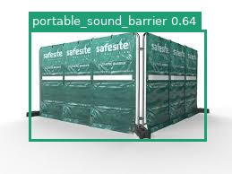</td>
<td>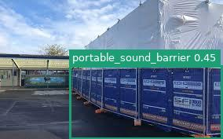</td>
<td>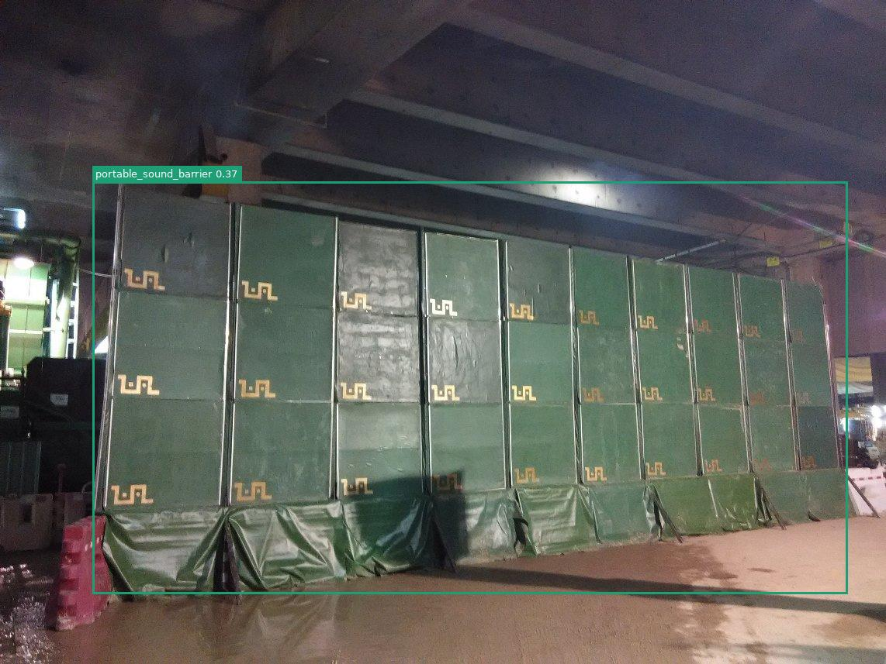</td>
</tr>
</table>

This is the most visually diverse class — green fabric Safesite enclosures (0.64), blue modular panel systems (0.45), and dark green quilted barriers in dim indoor scenes (0.37). The high intra-class diversity is the primary driver of the lowest AP in the evaluation set. Prompt ensembling (3 variants per class) partially addresses this: the green Safesite enclosure achieves the highest single-frame confidence in the entire dataset (0.64), but the dark indoor scene barely clears the threshold at 0.37. No single 14-token text prompt can simultaneously describe all three visual subtypes.

---

### Fixed sound barrier — AP@0.5: 1.0000 (N=4)

<table>
<tr>
<td>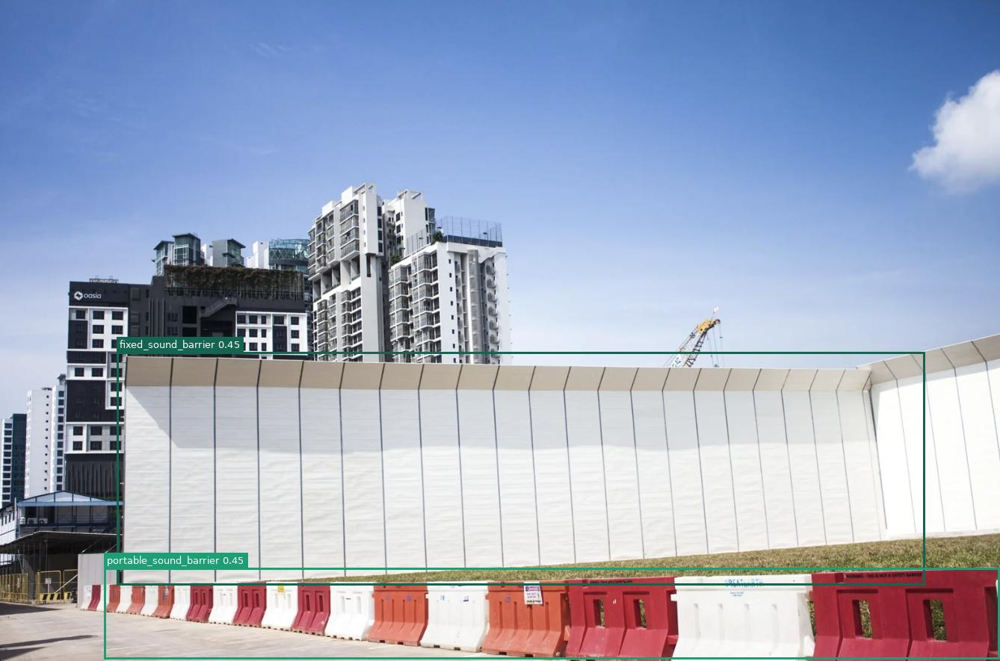</td>
<td>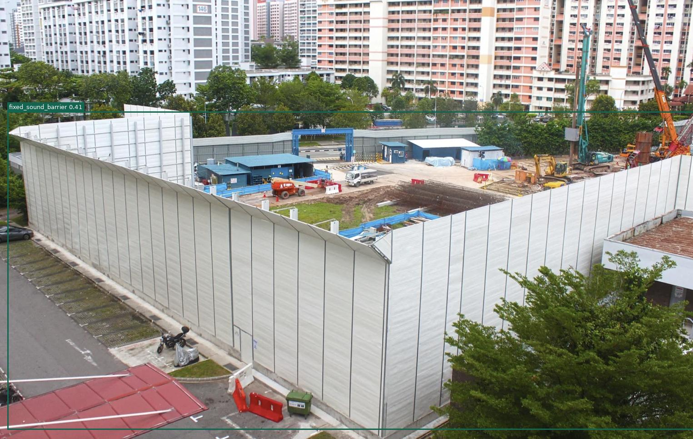</td>
</tr>
</table>

Perfect AP (1.00) across all 4 ground-truth instances. Large permanent hoarding walls are the most visually distinctive class in the dataset — they span a large fraction of the frame, have a uniform planar appearance, and sit in CLIP's embedding space well away from background clutter. The left image shows a dual-class detection (large white wall as `fixed_sound_barrier` 0.45, red jersey barriers in the foreground as `portable_sound_barrier` 0.45), correctly distinguishing between two co-occurring barrier types. The right image demonstrates detection from an elevated aerial perspective, showing the model generalises across viewpoint variation.

---

### Measuring tape — AP@0.5: 0.8713 (N=8)

<table>
<tr>
<td>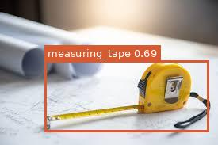</td>
<td>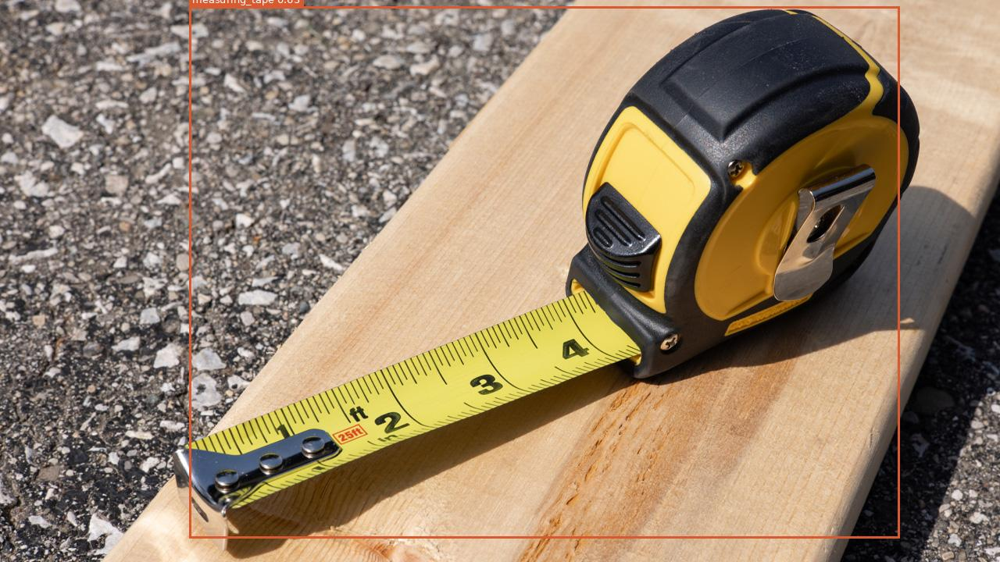</td>
<td>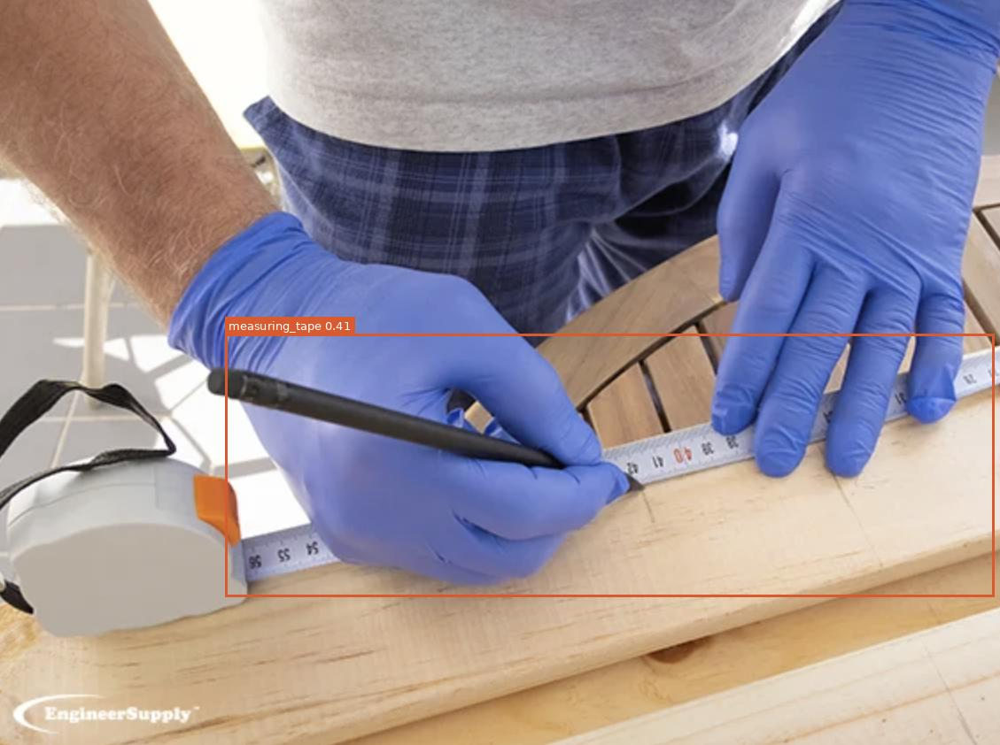</td>
</tr>
</table>

Second-highest AP (0.87 at IoU 0.5, 0.78 at IoU 0.5:0.95). The isolated close-up on blueprints achieves the highest measuring-tape confidence in the set (0.69). The slight drop from AP@0.5 to AP@0.5:0.95 reflects minor box boundary misalignment: the model tends to include the extended blade alongside the cassette body, slightly over-extending the predicted box. The right image shows a realistic egocentric use case — a gloved worker holding an extended tape at a workbench — demonstrating detection generalises across hand occlusion and diverse viewing angles, consistent with the 8-instance ground-truth count being the largest of all classes.

---

## Model

- **Model:** `google/owlv2-base-patch16-ensemble`
- **Speed:** ~3.7 FPS on NVIDIA RTX 5070 Ti Laptop GPU
- **Token limit:** OWL-ViTv2's text encoder has a hard 16-token limit (including special tokens). All prompts are kept within this budget.
